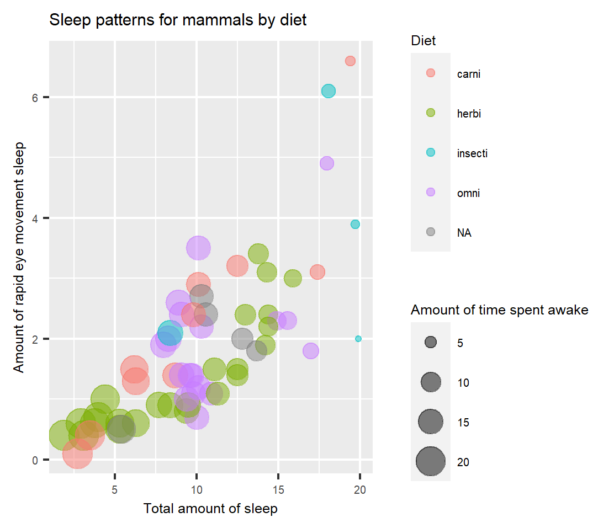

You do not need to edit anything in the `setup` R code chunk.
Note that I am setting your figure dimensions globally in this `setup` chunk.
Also note that this will be the only Learning Target Check that I will provide you with R code chunks and load packages for you.

```{r setup, include=FALSE}
knitr::opts_chunk$set(error = TRUE, fig.width = 6, fig.asp = 0.618)
library(ggplot2)
```

This Learning Target Check assesses your knowledge of the three Learning Targets and your ability to explain your work.

1. You *must* use the RStudio IDE and GitHub.

## Learning Targets

### [NEW] DS.2 - CORE: I can create graphical display of data that highlight key features

Data were collected on 83 mammals and are provided within `{ggplot2}` as the `msleep` dataset.

Use the code chunk provided below, recreate the following plot.
Notice that I provide more informative axes labels and a title and adjust the transparency for overplotting issues.
We have not seen how to do provide informative labels, but I think you should be able to explore how to do this.
Remember to cite any resources that you use.
Also, along with explaining your code, be sure to comment on what you notice in this plot.



```{r recreate-plot,out.width = "10000%", out.height="10000%",dpi=500 }
ggplot(data = msleep, mapping = aes(x = sleep_total, y =  sleep_rem, color=vore, size=awake))+ geom_jitter(position=position_jitter(width = 0.001, height =0.01),alpha=.5) + theme(legend.text = element_text(size=4, vjust=0.5)) + theme(legend.title = element_text(size=6, vjust=3)) + theme(legend.margin=margin(t = 0, unit='cm'))+ theme(plot.margin = unit(c(.5,4,1,2), "cm")) + theme(plot.title=element_text(size=7, vjust=0)) + theme(axis.title.y=element_text(size=7, angle=90, vjust=-0.5)) + theme(axis.title.x=element_text(size=7,vjust=.9)) + theme(axis.text.y= element_text(size = 5)) + theme(axis.text.x= element_text(size = 5)) + labs(title="Sleep patterns for mammals by diet", x= "Total amount of sleep", y="Amount of rapid eye movement sleep",color = "Diet", size = "Amount of time spent awake")
```


**Nikita**: The easiest thing to do first for this plot was to notice that it could be a jitterplot or a point plot, and to view the table.  Viewing the table allowed me to realize "vore" was "diet" in the table.  The colors were in reference to the diet and the size was in reference to the number of hours awake, which was the variable "awake".  Starting with the point plot, I realized that although I had my variables squared away, the distribution of the points appeared clustered at the lower end of the x-axis and I noticed that the plot was more vertical and smaller in width.  So I looked for options to change the dimensions and came across the theme group functions. I realized that the geom_point plot wasn't allowing me to change the dimensions so I tried the jitterplot instead. I also realized I needed to not only change the dimensions, but also the font size of the axises, the tick marks, and the legends.  So the former half of my code is the actual jitterplot functions, and the latter half is the theme plot functions for adjusting titles, fonts, legends, and axises.  We practiced labels in the primers so I didn't include the reference for that, but I did include all of the references for the theme code.  One thing I could not do, is enlarge the image after knitting to fit the size to match the original.  It would be great to better learn how to do this.

Overall it appears majority of the mammals are herbivores and the fewest mammals are insectivores. This dataset also had 22 rows of missing values so Im not sure if those quanities would differ if we included the missing values. I notice that the mammals that are herbivores get ~15 hrs of sleep or less than the the mammals who are insectivores and omnivores.   Majority of the carnivores sleep 10 hours or less.  I see that the omnivores are all clustered around the 10 hour mark, and majority of them sleep 10 hours or less.  I don't see any herbivores that sleep less than 10 hours but I assume they are hiding behind the hervbivore clusters. Though carnivores logically need to stay awake more than omnivores and herbivores to hunt, it seems herbivores tend to stay awake the most.  Insectivores appear to be the animals that sleep the most (~20 hours) and are awake the least.  There is one insectivore that spends much of its time awake.  Also majority of the mammals that sleep around 15 hours, appear to have REM sleep of 4 hours. Insectivores and omnivores that get atleast 20 hours of sleep have at least 6 hours of REM sleep, logically having more hours of sleep altogether compared to herbivores and carnivores.

References: 
**modifying theme**:https://rkabacoff.github.io/datavis/modifyingthemes.pdf

**modifying theme**:https://ggplot2.tidyverse.org/reference/theme.html

**modifying theme**:https://stackoverflow.com/questions/9639127/adjust-position-and-font-size-of-legend-title-in-ggplot2

**modifying theme**:https://stackoverflow.com/questions/17073772/ggplot2-legend-on-top-and-margin

**adding images after knitting**:http://zevross.com/blog/2017/06/19/tips-and-tricks-for-working-with-images-and-figures-in-r-markdown-documents/


### [NEW] PD.1 - CORE: I can use a project-based workflow to organize and run reproducible analyses

Go to your `ltc01-<username>` repo on GitHub.
In the main directory of your repo, edit the README file with the following after the title, but before the introductory paragraph that begins with, "This Learning Target Check is due by ...":

- Find a picture of your favorite mammal as a web link and display it (do not download a file or upload a file to your repo)
- Provide a brief description of what this mammal is

Do not forget to provide an explanation here.

**Nikita**: This is a **Cow** that comes from the Bos *genus* and is a herbivore 	**Artiodactyla** which is domesticated and sleeps a total of 4 hrs a day.  It spends 0.7 hrs in *REM* sleep and spends about 20 hours being awake.
```{r, echo=FALSE, out.width="50%", fig.cap="A nice image."}
knitr::include_graphics("https://pngimg.com/uploads/cow/cow_PNG50557.png")
```
references: **learning about cows**:https://en.wikipedia.org/wiki/Cattle

### [NEW] PD.4: I can identify and correct common collaboration errors when working with Git/GitHub

Do this after completing DS.2 and PD.1.

Successfully pushing your work to GitHub will satisfy this target.
Do not forget to describe and provide an explanation for how you resolved the issue that you ran when doing this.

**Nikita**:


## Wrapping Up

Knit your report and verify that it looks as you intended it to. Then, verify the Submission Checklist Statements in this Learning Target Check's README.---